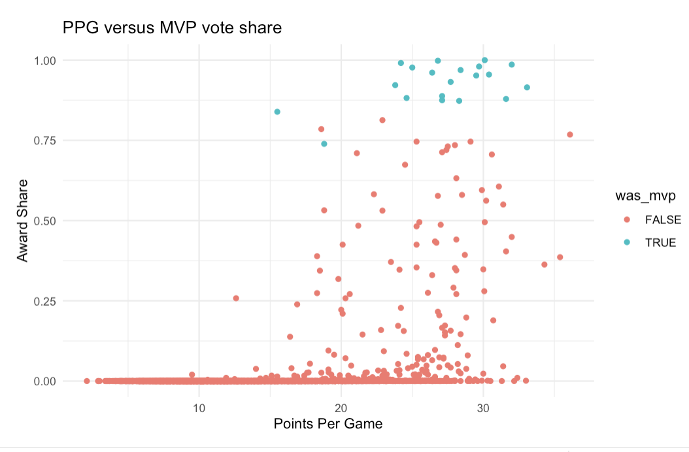
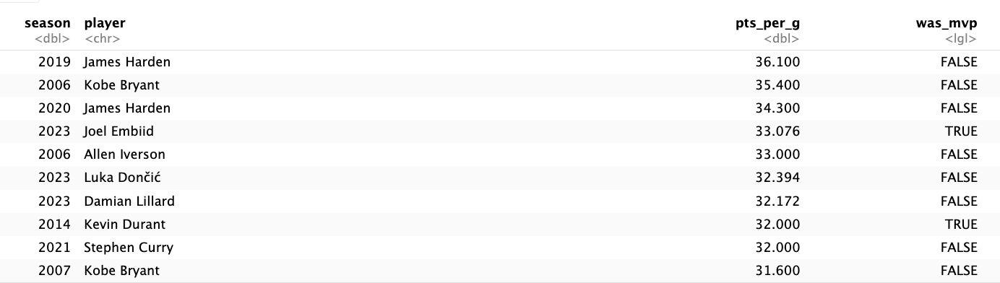

```{r setup, include=FALSE}
knitr::opts_chunk$set(echo = TRUE)
library(tidyverse)
library(readxl)
library(magrittr)
library(tinytex)
library(ggplot2)
library(skimr) # see summaries
library(randomForest)
library(caret)
library(ISLR) # gene expression data set
library(ranger) # faster computation for bagging
library(Metrics) # rmse(), mape(), accuracy(), auc()
library(pdp) # partial dependence plot
library(dplyr)
library(lares)
library(stats) # addmargin()
library(pROC) # roc()
library(sampling) # statified sampling, strata()
library(plotrix)
library(corrplot)
```
# A case study on MVP Prediction for the 2023-2024 Season

Who is the NBA MVP this season? Can we create a model that predicts the outcome?

## Executive Summary

This case study employs various statistical modeling techniques to predict the 
NBA's Most Valuable Player (MVP) for the 2023-2024 season. The objective was 
to establish a predictive model that utilizes both traditional and 
advanced basketball statistics to forecast the MVP voting patterns based on 
player performance metrics.

The models consistently suggest Nikola Jokic as the front runner for the 
2023-2024 MVP award, followed by other top performers like Giannis Antetokounmpo, 
Shai Gilgeous-Alexander, and Luka Dončić. While Joel Embiid was also consistently 
ranked in the top 5 in most models, his reduced games played disqulify him from 
the award due to new rules this season mandating at least 65 games played.
Surprisingly, Domantas Sabonis frequently appears in the top 10 across 
different models, highlighting a potential underestimation of his impact 
in traditional discussions.

The Random Forest model outperformed Multi Linear Regression 
(MLR) in predicting historical MVPs, accurately identifying 17 out of 20 MVPs 
in the test data. Both models, however, have shown limits, particularly in years 
with close races influenced by narrative-driven voting (e.g., voter fatigue).

Advanced techniques like Boosted Random Forest and h2o ensemble methods further 
refined the predictions (18/20) seasons correct with the ensemble methods having 
a slightly lower RMSE score. Both models see Joel Embiid gaining vote share 
despite his lack of games played, 


## Background

So what is an MVP? 
While the NBA organization hasn't formally ever given a definition for 
the criteria of the award, in most sports the MVP is awarded to the player who 
has had the BEST PERFORMING REGULAR SEASON. 

Until the 1979-1980 season, the MVP was selected by NBA players but since then, 
the award has been decided by a panel of sportswriters and broadcasters from the 
United States and Canada. Each member casts 1st to 5th place selections, 
with 1st place votes worth 10 points, 2nd place votes worth 7 points, 3rd place 
votes worth 5 points, 4th place votes worth 3 points and 5th place votes worth 1 point.
It is converted into a scale from 0 to 1, a person who doesn't garner any votes being
a 0 while a unanimous MVP would have an award share of 1 (All voters vote the 
same person as 1st place).

Over the years, people have discussed different criteria for selecting an MVP. 
Some say it should be the best player on the best team. Other's say it should be 
player with the best stats. An example of the types of discussion can be seen
here from JJ Redick (former NBA player turned media member): 
(https://www.youtube.com/watch?v=7F8nuqIhEGk)

People used to think that whoever scores the most points usually 
should be the MVP: 





While scoring does play a factor, we can see from the data the top scorer doesn't
always win the award. In fact, the top 3 scoring seasons from our dataset, 
as well as 8 out of the top 10 best scoring seasons have not resulted in the player's 
winning the MVP in that season! So how exactly do we determine the MVP?

Regardless of what it is, what it boils down to is that it is somewhat of 
a popularity contest. Since media members are the ones voting on the award, 
they will unconsciously bias towards whoever has had the better narrative 
throughout the season. There has also been cases where people have thought some 
players deserve to win, but because they have won in prior years, the voters 
experience "fatigue" from seeing the same player win. 

This is clearly concerning because while some players may have the play style 
that garners the attention, there are others who deserve the attention based on 
their pure production because **after all it shouldn't be how you do it but what you do.**

But why does this matter? For teams, having an NBA MVP on your team means a good 
chance of winning the NBA Championship.  Since the 1984-1985 season, only five teams 
have won an NBA championship without having a player on the All-NBA First Team 
(Top 5 players in the NBA). That means 86.8 % of all NBA champions since then 
have had a top 5 player on their team! 

For the player, winning the MVP in the NBA is a prestigious honor, 
an individual accolade reserved for only the best players. While the direct 
monetary incentives are not much (the winner gets a KIA car as it is the sponsor 
for the award), the status of winning the award usually means a significant 
uptick in earning potential, usually in the form of endorsement deals or better 
contracts in future years. 

In this case study I will examine the award share of MVP's and see 
if we can use player's production to make an estimate on who will win the 
MVP award this season (2023-2024) To do this I will use traditional box score 
statistics like points, assists and rebounds as well as Advanced Statistics to 
come up with models that try and predict the award share the players will get at 
the end of the season. In essence, I am trying to predict the amount of vote 
share a player should get based on their production, see if this lines up with 
NBA MVP winners of the past, and come up with an accurate prediction for who 
the MVP will be this season (2023-2024). To clarify this doesn't mean the model 
should give the best player period, rather it should give us who deserves the
MVP based on their production.


## Data Processing - Example Cleaning of Datasets: 2024 season (Test Set)

Datasets are sourced from Basketball Reference, a credible source for official 
NBA statistics (Partnered with NBA)

```{r}
totals <- read_xlsx("2024 NBA Totals.xlsx")
adv <- read_xlsx("2024 NBA Advanced.xlsx")
pbp <- read_xlsx("2024 NBA PBP.xlsx")
```

So my totals data frame includes regular counting statistics such as made and 
missed shots, assists(passing to someone and they make a shot), rebounds 
(getting the ball after a missed shot) etc. These are classical statistics. 

The adv data frame includes Advanced Stats. These are metrics that people have 
come up with the estimate things that counting stats dont. For example PER is 
Player efficiency Rating, a statistic that aims to capture a player's 
effectiveness per minute. There are also other things like TS%, which is 
True shooting percentage. This is because regular counting stats don't take 
into account that 3 pointers are worth more than 2 pointers, so shots made 
from 3 point distance should hav ea higher weightage than those shot from 2. 

Last but not least, the pbp data frame includes play by play data. 
These things are not in the typical box score and are usually either hand 
tracked or measured after a game ends and through review of game footage. 
For example, Shooting Fouls drawn is a measure of how many fouls a player got other 
players to foul them. 

I've joined all these datasets together to come up with a big training set.
I've done this also for every single season from 2004 to 2023 and used the 
existing data from the current season (2023-2024). The main changes I made was 
I had to add a column for season, as well as combining Off Court Plus/Minus with 
Net Plus Minus to a single stat as an mov ("margin of victory"). However during
my cleaning, I realized that this stat had non zero variance, so I discarded it
as a column (Although I still believe plus minus is a good way to measure value, 
it is inherently noisy with single season data and would need to be aggregated 
over multiple seasons to get a clearer picture, which defeats the purpose of
trying to figure out a single season MVP). I also got rid of some other columns
like AND1,BLKD, PGA, Offensive Fouls Drawn etc. as they would result in double 
counting with missed field goals as well as points and assists totals.

```{r, include = FALSE}
totals <- subset(totals, select = -c(Age, Tm, GS, Pos))
adv <- subset(adv, select = -c(Age, Tm, Pos, ...19))
pbp <- subset(pbp, select = -c(Age, Tm, Pos)) #will get rid of the rest later
```
```{r, include = FALSE}
#Change Row Columnn names to be more intuitive
totals_cleaned <- totals %>%
  group_by(Player) %>%
  summarise(
    g = sum(G), 
    mp = sum(MP),
    mp_per_g = sum(MP)/sum(G),
    fg_per_g = sum(FG)/sum(G),
    fga_per_g = sum(FGA)/sum(G),
    fg_pct = sum(FG) / sum(FGA),
    fg3_per_g = sum(`3P`)/sum(G),              
    fg3a_per_g = sum(`3PA`)/sum(G),
    fg3_pct = sum(`3P`) / sum(`3PA`),  
    fg2_per_g = sum(`2P`)/sum(G),
    fg2a_per_g = sum(`2PA`)/sum(G),
    fg2_pct = sum(`2P`)/sum(`2PA`),
    efg_pct = sum(`eFG%`),
    ft_per_g = sum(FT)/sum(G),                 
    fta_per_g = sum(FTA)/sum(G),               
    ft_pct = sum(FT) / sum(FTA), 
    orb_per_g = sum(ORB)/sum(G),               
    drb_per_g = sum(DRB)/sum(G),               
    trb_per_g = sum(TRB)/sum(G),               
    ast_per_g = sum(AST)/sum(G),               
    stl_per_g = sum(STL)/sum(G),               
    blk_per_g = sum(BLK)/sum(G),               
    tov_per_g = sum(TOV)/sum(G),               
    pf_per_g = sum(PF)/sum(G),                 
    pts_per_g = sum(PTS)/sum(G)                
  ) %>%
  ungroup()
totals_cleaned


```

```{r, include = FALSE}
adv_cleaned <- adv %>%
  group_by(Player) %>%
  summarise(
    g = sum(G), 
    mp = sum(MP),
    mp_per_g = sum(MP)/sum(G),
    per = mean(PER, na.rm = TRUE),
    ts_pct = mean(`TS%`, na.rm = TRUE),
    fg3a_per_fga_pct = mean(`3PAr`, na.rm = TRUE),
    fta_per_fga_pct = mean(`FTr`, na.rm = TRUE),
    orb_pct = mean(`ORB%`, na.rm = TRUE),
    drb_pct = mean(`DRB%`, na.rm = TRUE),
    trb_pct = mean(`TRB%`, na.rm = TRUE),
    ast_pct = mean(`AST%`, na.rm = TRUE),
    stl_pct = mean(`STL%`, na.rm = TRUE),
    blk_pct = mean(`BLK%`, na.rm = TRUE),
    tov_pct = mean(`TOV%`, na.rm = TRUE),
    usg_pct = mean(`USG%`, na.rm = TRUE),
    ows = sum(OWS, na.rm = TRUE),
    dws = sum(DWS, na.rm = TRUE),
    ws = sum(WS, na.rm = TRUE),
    ws_per_48 = mean(`WS/48`, na.rm = TRUE),
    obpm = mean(OBPM, na.rm = TRUE),
    dbpm = mean(DBPM, na.rm = TRUE),
    bpm = mean(BPM, na.rm = TRUE),
    vorp = sum(VORP, na.rm = TRUE)
  ) %>%
  ungroup()

#Only concerned about plus-minus (sum is margin-of-victory)
pbp_cleaned <- pbp %>%
  group_by(Player) %>%
  summarise(
    g = sum(G), 
    mp = sum(MP),
    mp_per_g = sum(MP)/sum(G),
     mov = mean(`OnCourt`, na.rm = TRUE) - mean(`On-Off`, na.rm = TRUE)
  ) %>%
  ungroup()


# Join all datasets together
test_data <- totals_cleaned %>%
  inner_join(adv_cleaned, by = c("Player", "g", "mp_per_g","mp")) %>%
  inner_join(pbp_cleaned, by = c("Player", "g", "mp_per_g","mp")) %>% 
  mutate(season = 2024,
         award_share = 0)#award_share is 0, because we don't know yet (results for this season hasn't come out)


#Impute NA values to 0
test_data <- replace(test_data, is.na(test_data), 0)
names(test_data)[1] <- "player"
```


Final DF:
```{r, warning = 'FALSE'}
df <- read_excel("FINALFINALDATASETNBA.xlsx")

```


### Feature Engineering
```{r, include = FALSE}
#rounding off 
df <- df %>% 
 mutate(across(is.numeric, round, digits=3))

# Change character columns to numeric (Since some of the percentages are in character form)
char_columns <- names(df)[sapply(df, is.character)]
filtered_char_columns <- char_columns[char_columns != "player"]

for (col_name in filtered_char_columns) {
  df[[col_name]] <- as.numeric(df[[col_name]])
}

# Change observations with 'NA' strings to 0
df <- replace(df, is.na(df), 0)

```

We have to add in a column for who won the award that season, which 
I will call in a column called was_mvp. This would be whoever has the greatest
mvp_share for each season

```{r}
mvps <- df %>%
  group_by(season) %>%
  summarise(max_award_share = max(award_share)) %>%
  mutate(was_mvp = TRUE)  


df <- df %>%
  left_join(mvps, by = c("season" = "season", "award_share" = "max_award_share"))


df <- df %>%
  mutate(was_mvp = dplyr::if_else(is.na(was_mvp), FALSE, TRUE)) 
```


### EDA


```{r}
num_vars <- sapply(df, is.numeric)
correlations <- cor(df[,num_vars], use = "complete.obs")
corrplot(correlations, method = "circle")

df %>% select(-c(was_mvp)) %>% #not including was_mvp, obviously
  corr_var(award_share,
           top = 5) 
```


Unsurprisingly, Vorp stands out as the variable that has the highest correlation, albeit less than 0.5. It stands for Value Over Replacement Player, which is a statistic that is supposed to measure how much value a palyer provides a team over a replacement player. As a valuable player should provide the most value over a replacement, it makes sense why this statistic should be higly correlated.

OWS and WS stand for offensive win shares and win shares respectively. It is a statistic that measures how mnay wins a player adds to their teams season, For example a player with + 2 win shares theoretically means that if you take that player off the team, their team will win 2 less games than originally. Offensive win shares would be wins contributed through a players offense. This also makes sense since the best players should theoretically help their team win more games. Intrestingly, there is no defensive win shares here, but there is some debate on the calculation
of defensive win shares, as it is possible to have negative offensive win shares while it is not for defensive win shares, making offensive win shares better at capturing differences between players.

fta_per_g, which represents free throws attempted per game is also an interesting stat that seems to be correlated with award_share. My working theory on this is that the star players in the NBA tend to shoot the most free throws (Whether that is because they are good at drawing fours or the referees favor these players is also another debate).

Funnily enough, the player LeBron James being correlated with award_share when set as a dummy variable is actually a good sanity check, as during the period in which I have set (2004-2022), he is the player that has won the award the most times (4). We can verify this in our data set:
```{r}
df %>% group_by(player) %>% 
  summarise(mvp_count = sum(was_mvp)) %>% 
  arrange(desc(mvp_count)) %>% top_n(10) %>% 
 ungroup()
```


### Further Feature Engineering
We have a problem of imbalanced data (low proportion of players get mvp votes)
```{r}
has_mvp_shares <- df[df$award_share > 0, ]
doesnt_have <- df[df$award_share == 0,]
nrow(has_mvp_shares)/nrow(doesnt_have)
```
Less than 2% of all players in our data set even get any votes at all. To solve this, 
we can get rid of players that have little to no chance of getting the award, either because
they don't play a lot, didn't start a lot of games, etc.
\tiny
```{r}
ggplot(data = has_mvp_shares,aes(x = mp_per_g))+
  geom_histogram(bins = 20)

ggplot(data = has_mvp_shares, aes(x = g))+
  geom_histogram(bins = 20)
```
\normalsize
```{r}
cat("Minimum amount of minutes played with MVP shares: " , min(has_mvp_shares$mp_per_g))
cat("\n")
cat("Minimum amount of games played with MVP shares: " , min(has_mvp_shares$g))
```

So in our data set, no one who has played under 25.6 minutes a game
and has played less than 39 games has ever gotten vote shares , so let's get
rid of players who don't satisfy these requirements loosely.

```{r}
df <- df[(df$mp_per_g >= 20 & df$g >= 20), ]
test_data <- test_data[(test_data$mp_per_g >= 20 & test_data$g >= 20),]
#this also solves the problems that I encounter later
#Instead of trimming off less seasons, we get a more focused data set!
```


During feature engineering, we have to get rid of features that 
are repetitive (highly correlated) and add no value. For example:
```{r}
repetetive_demo <- df %>% select(fg_per_g, fg_pct, fga_per_g)
repetetive_demo$fga_per_g <- as.numeric(repetetive_demo$fga_per_g)
repetetive_demo$fg_pct <- as.numeric(repetetive_demo$fg_pct)
repetetive_demo$fg_per_g <- as.numeric(repetetive_demo$fg_per_g)
repetetive_demo$product_fga_fg_pct <- repetetive_demo$fga_per_g * repetetive_demo$fg_pct
ggplot(repetetive_demo, aes(x = fg_per_g, y = product_fga_fg_pct)) +
  geom_point() +
  labs(x = "fg_per_g", y = "fga_per_g * fg_pct", title = "Repetitive Stats")
cor(repetetive_demo$fg_per_g, repetetive_demo$product_fga_fg_pct, use = "complete.obs")
#It isn't completely 1 because of rounding off from the percentage column
```
This is because field goals made can be calculated as the product of the number 
of attempted field goals and the percentage, which renders field goals made 
redundant as a statistic. This same logic can be applied to other totals that 
can be the sum or product of other columns respectively:

```{r, message= FALSE}
df <- subset(df, select = -c(fg_per_g, fg3_per_g, fg2_per_g, ft_per_g, trb_per_g))
test_data <- subset(test_data, select = -c(fg_per_g, fg3_per_g, fg2_per_g, ft_per_g, trb_per_g))
```


# Models
Now we can try multiple different models and see the results we get from each model. 
As we are trying to predict award share, a number that is between zero and one, 
the first model and simplest models we can use is multi-linear regression: 

## Multi Linear Regression 

```{r, warnings = FALSE}
model_df <- select(df, -was_mvp, -player, -season)
lm_df <- model_df
#Linear Model
linear_model <- lm(award_share ~ ., data = model_df)
summary(linear_model)
```

Clearly, our model is not very good, with an R2 of 0.3681, which means that 
only 36.81% of the variability in award_share can be predicted by our model.
We can see what the predictions for previous years yielded.

```{r, message=FALSE}
lm_df$pred_award_share <- linear_model$fitted.values
df <- df %>% inner_join(lm_df)
df %>% group_by(season) %>% 
  slice(which.max(pred_award_share)) %>% 
  summarise(player = player,
            season = season,
            predicted_share = pred_award_share,
            was_mvp = was_mvp
            )
```
As expected, the model wasn't able to accurately predict the MVP winner for all 20 
seasons (10 out of 20 were correct). Lebron James has been the most frequent winner
in our dataset, so it makes sense that the model predicts he wins the award alot.
In factm for some of the years, for example in 2011, the MVP race between 
LeBron James and Derrick Rose was close, with Rose ultimately winning
the award. However, many still believe it was due to voter fatigue (people not wanting the same
person to win MVP every year) which led to Rose winning the award that season. This was
also a similar narrative last season, where people believed Nikola Jokic should have 
won the award but due to voter fatigue, Joel Embiid won it instead. 


Nevertheless, let's see what MLR predicts for this current season
```{r, message = FALSE}
test_data_subset <- select(test_data, -player, -season)


predictions <- predict(linear_model, newdata = test_data_subset)

test_data$pred_award_share <- predictions

test_data %>% 
  arrange(desc(pred_award_share)) %>% 
  select(player, pred_award_share) %>% 
  top_n(10)
```
Nikola Jokic seems like the front runner for the award this season. 
9 out of the top 10 for this award are also some of the best players in the NBA, 
(Domantas Sabonis is somewhat of an outlier here) and I believe that the actual
results that will be announced soon will somewhat mirror this ranking as well.

## Random Forest
To boost accuracy and prediction stability compared to our linear regression model, 
we can adopt the random forest model as it is less prone to over-fitting due to how
it randomly selects different subsets of data to train on and averages out the 
results. 


```{r}
set.seed(123)
rf_df <- model_df
ctrl <- trainControl(method = "cv", number = 10)
met <- "RMSE"
fit.award <- train(award_share ~ .,
                  data = rf_df,
                  method = "rf",
                  metric = met,
                  trControl = ctrl,
                  importance = TRUE)
```


```{r}
set.seed(123)
vi.award <- varImp(fit.award, scale = FALSE)
plot(vi.award, top = 20)
pred.rf.award <- predict(fit.award, newdata = test_data_subset)
postResample(pred = pred.rf.award, obs = test_data_subset$award_share)
```
It seems like VORP, PER, BPM, WS and fta_per_g are our top 5 most important 
stats for this model. This makes sense since. VORP, PER, BPM and WS are stats
meant to capture a players value. As for fta_per_gm my working theory is that most
great NBA players are able to generate alot of free throws (whether it is skill
or referee favoritism is another issue altogether), so players who generally have a 
greater award share tend to shoot more free throws aswell. 
This model also has a low RMSE of 0.08716.


```{r}
df <- select(df, -pred_award_share)
pred.rf.award_train <- predict(fit.award, newdata = df)

df$row_id <- row.names(df)
predictions_df <- data.frame(pred = pred.rf.award_train, row_id = df$row_id)

# Joining predictions back to the test_data using row_id
df_train <- left_join(df, predictions_df, by = "row_id")

df_train %>% group_by(season) %>% 
  slice(which.max(pred)) %>% 
  summarise(player = player,
            season = season,
            predicted_share = pred,
            was_mvp = was_mvp
            )
```
Our random forest model has a much better success rate on our test set than the 
MLR model we ran earlier (18/20 correctly predicted). 

For the players that the random forest got wrong, there was a legitimate argument 
to be made that those players should have won the award that year. 
Shaquille O'Neal brought his new team (Miami Heat) to win the championship 
for the first time ever in franchise history, Lebron James in 2006 was blossoming 
into a star and even brought his team to the Finals despite a poor supporting 
cast. Steve Nash actually won the award in 2005 and 2006, but his 2007 campaign 
was statistically better as he bumped up his scoring averages as well as his 
assists from the two prior seasons (Could be  a case of voter fatigue/narrative 
that he isn't that good to deserve three consecutive MVP awards)


```{r, message = FALSE}
#Get rid of previous prediction using MLR
test_data <- select(test_data, -pred_award_share)
test_data$row_id <- row.names(test_data)
predictions_df <- data.frame(pred = pred.rf.award, 
                             row_id = test_data$row_id)

# Joining predictions back to the test_data using row_id
test_data <- left_join(test_data, 
                       predictions_df, by = "row_id")

options(scipen = 999)
test_data %>% 
  arrange(desc(pred)) %>% 
  summarise(player = player,
            games_played = g,
            predicted_share = pred) %>% 
  top_n(10)

```
Again Nikola Jokic seems llike our front runner, with Giannis, Shai and Luka
behind him.

If we look at the front runners, Joel Embiid is now seen as a frontrunner for 
the award despite only playing 37 games. Before he got injured, he was actually 
leading candidate to win the MVP this season. 

However, something I have not factored into the model is the new requirements 
to actually be an MVP this season. There was a new rule implemented that required 
players to play at least 65 games to be considered for the award, 
something that was not the case previous. 

The reason why I didn't do this before was also to have a greater dataset. I was also
interested to see if number of games played would have a sizable impact on the 
award share. For this random forest model, it seems like that is not the case.


## Boosted RF

Let's try to improve the accuracy of our model using boosting
```{r}
set.seed(123)
met <- "RMSE"
ctr <- trainControl(method = "cv",
                    number = 3,
                    search = "grid" )# "random")
                    
tgr <- expand.grid(n.trees = c(1:3) * 100,
                   shrinkage = c(0.1, 0.2),
                   interaction.depth = c(1:2),
                    n.minobsinnode = c(10, 20))

fit.boosted <- train(award_share ~ .,
                     data = model_df,
                     method = "gbm",
                     distribution = "gaussian",
                     metric = met,
                     trControl = ctr,
                     tuneGrid = tgr,
                     verbose = FALSE) 

pred.boosted.rf.award_train <- predict(fit.boosted, newdata = df)
postResample(pred = pred.boosted.rf.award_train, obs = model_df$award_share)
df$row_id <- row.names(df)
predictions_df <- data.frame(pred = pred.boosted.rf.award_train, 
                             row_id = df$row_id)

# Joining predictions back to the test_data using row_id
df_train <- left_join(df, predictions_df, by = "row_id")

df_train %>% group_by(season) %>% 
  slice(which.max(pred)) %>% 
  summarise(player = player,
            season = season,
            predicted_share = pred,
            was_mvp = was_mvp
            )
```

17/20 Correct. 
For the players that the random forest got wrong, there was a legitimate 
argument to be made that those players should have won the award that year. 
Shaquille O’Neal brought his new team (Miami Heat) to win the championship 
for the first time ever in franchise history, while remaining a dominant force
in the NBA while Dirk Nowitzki was known to be an offensively gifted player, who 
was in contention for the award for numerous years (won it in 2007 but was also
under major consideration in 2006) In 2008, many people considered 
Chris Paul to be the deserving winner of the MVP award due to his production 
and leading a mediocre team to the playoffs but the award was given to Kobe Bryant 
(Probably due to his consistent productions and the fact he hadn't won the award 
until that point - reverse voter fatigue?). 

```{r, warnings = FALSE}
set.seed(123)
pred.boosted <- predict(fit.boosted, newdata = test_data_subset)
postResample(pred = pred.boosted, obs = test_data_subset$award_share)

test_data$row_id <- row.names(test_data)
predictions_df <- data.frame(pred = pred.boosted, row_id = test_data$row_id)

#Get rid of previous predictions
test_data <- select(test_data, -pred)

test_data <- left_join(test_data, predictions_df, by = "row_id")


test_data %>% 
  arrange(desc(pred)) %>% 
  summarise(player = player,
            games_played = g,
            predicted_share = pred) %>% 
  top_n(10)

```
Again Nikola Jokic seems to be the favorite to win the award, followed by the usual
candidates (Giannis, Shai, Luka and Embiid). 
Even with the boosted model, Joel Embiid appears to be an MVP candidate 
if we disregard his lack of games played this season. 

Another interesting thing to take note of is that Joel Embiid has now appeared 
to be a front runner in both random forest models,which could point to an 
overemphasis on games played. 


## Super Learners: H2o

```{r, include = FALSE}
library(h2o)
h2o.init()
```
### H2o Regression - Stacked Ensemble 
```{r, warning = FALSE}
set.seed(123)
train <- h2o.importFile("Test Data.csv")
test <- h2o.importFile("2024 Cleaned Season.csv")
# set the predictor names and the response column name
predictors <- colnames(train)[2:41]
response <- "award_share"

nfolds <- 6

h2o_glm <- h2o.glm(x = predictors,
                   y = response,
                   training_frame = train,
                   remove_collinear_columns = TRUE,
                   nfolds = nfolds,
                   fold_assignment = "Modulo",
                   keep_cross_validation_predictions = TRUE, 
                   seed = 6,
                   alpha = 0.25)
h2o_rf <- h2o.randomForest(x = predictors,
                           y = response,
                           training_frame = train,
                           ntrees = 100,
                           nfolds = nfolds,
                           fold_assignment = "Modulo",
                           keep_cross_validation_predictions = TRUE,
                           seed = 6)
h2o_gbm <- h2o.gbm(x = predictors,
                  y = response,
                  training_frame = train,
                  ntrees = 5000,
                  learn_rate = 0.01,
                  max_depth = 3,
                  min_rows = 3,
                  sample_rate = 0.7,
                  nfolds = nfolds,
                  fold_assignment = "Modulo",
                  keep_cross_validation_predictions = TRUE,
                  seed = 6,
                  stopping_rounds = 50,
                  stopping_metric = "RMSE",
                  stopping_tolerance = 0)

# Train a stacked ensemble using all trained base learners
fit.ensemble <- h2o.stackedEnsemble(x = predictors,
                                    y = response,
                                    training_frame = train,
                                    model_id = "my_ensembles",
                                    base_models = list(h2o_glm, h2o_rf, h2o_gbm),
                                    metalearner_algorithm = "drf")


original <- read.csv("Test Data.csv")

predict <- h2o.predict(object = fit.ensemble, newdata = train)
predictions_h2o <- as.data.frame(predict)
original$row_id <- row.names(original)
predictions_df <- data.frame(pred = predictions_h2o, row_id = original$row_id)

h2o_glm_test_df <- left_join(original, predictions_df, by = "row_id")

h2o_glm_test_df %>% 
  group_by(season) %>%
  slice(which.max(predict)) %>% 
  summarise(player = player,
            season = season,
            predicted_share = predict,
            was_mvp = was_mvp)
```
Seems like our model has the same performance as our boosted random forest model 
(17/20 correct and even the same season were the ones that were incorrect). For
2006, the stacked ensemble seem to 

Although our predictions didn't improve much for the training set, if we look closer 
the RMSE score has improved slightly. 
```{r}
h2o.performance(model = fit.ensemble, newdata = train)
```
Low RMSE score on our training set : 0.023, a better number than the 0.028 we got
for RMSE on the boosted random forest model. Now let's see what the performance 
is for our testing set.
```{r, warning = FALSE}
set.seed(123)
# predict using testing dataset
predict <- h2o.predict(object = fit.ensemble, newdata = test)
predictions_h2o <- as.data.frame(predict)
original <- read.csv("2024 Cleaned Season.csv")
h2o.performance(model = fit.ensemble, newdata = test)
```
OUR RMSE score is slightly lower for our stacked ensemble model versus our 
Boosted Random Forest model for the test set, which had an RMSE score of around 0.08
while this RMSE score is lower at 0.074, suggesting that our stacked ensemble
model has improved compared to the boosted random forest. 

```{r, warning = FALSE}
original$row_id <- row.names(original)
predictions_df <- data.frame(pred = predictions_h2o, row_id = original$row_id)


# Joining predictions back to the test_data using row_id
h2o_glm_df <- left_join(original, predictions_df, by = "row_id")

h2o_glm_df %>% 
  arrange(desc(predict)) %>% 
  summarise(player = player,
            games_played = g,
            points = pts_per_g,
            predicted_share = predict) %>% 
  top_n(10)
```
Again, Nikola Jokic takes the top spot in our MVP award race. While the 
RMSE scores for both the boosted random forest and this stacked ensemble were 
quite close, we can see a shake up in our standings for the top 10 spots. 
In this model, we see new additions to our top 10 which include former MVP
LeBron James and surprisingly, rookie sensation Victor Wembanyama. Despite his
older age, LeBron has continued to play a vital role on his team (alongside his 
teammate Anthoy Davis) while Wembanyama has been playing on a team that is 
struggling (Victor Wembanyama's team has a winning percentage of .259 - 
ranking in the bottom 5 worst records in the NBA)

# Conclusion
Nikola Jokic should be crowned the winner of the NBA MVP award
for this season (2023-2024). As of today (April 20th), the MVP award hasn't been
announced yet so I am unable to verify the accuracy of models for the testing set.
However based on most voters who have gone public with their votes, it seems
like Nikola Jokic will win the award. Then again, voter fatigue could come into 
play again like last season where he should have won the MVP award...

We have also seen the same few candidates vying for the top 5 spots, namely
Luka Doncic, Giannis Antetokoumpo, Shai Gilgeous-Alexander and Joel Embiid. 
Unfortunately for him, Joel Embiid is ineligble for the award due to a new rule that 
came out this season that required a minimum of 65 games played.

Another thing to notice is Domantas Sabonis, who has appeared consistently in 
the top 10 for each of these models listed, yet he has never been considered to be one
of the better players in the league. Despite having consistently impressive 
production on a decent team, his name is never mentioned when it comes to the 
best players in the league. My hypothesis on this is that the basketball
community not appreciating his value enough simply because his playing style
is not "aesthetic".

But perhaps this points to a different conversation altogether, that the system 
that helps an MVP is win is entirely flawed. The very fact that is a vote by 
media members (sportswriters and broadcasters) makes it very subjective in the 
first place. 


## Limitations


I would also like to reiterate that this case is NOT WHO IS THE BEST PLAYER IN THE NBA, 
rather it is to see how we can predict who will win the award based on their 
production during the season. 

The reason I did not try to identify who is the best player in the NBA is because 
it is nearly impossible to find out from stats we can find freely. Defensive stats 
have notoriously failed to capture the overall impact of a player, 
as things such as deterrence are not tracked. Other stats such as Plus Minus 
data are inherently noisy and random within seasons as they may be boosted by 
playing against weak teams with strong teammates which lead to blowout wins etc. 

Something this case study does not cover is the presence of new stats. For example 
Second Spectrum, a company that specialises in data for sports teams, has gained 
prominence in the last few years for their video indexing software which utilises 
machine learning to track even more stats in detail, which include 3D spatial data 
that can give even more insight into player performance. Things like field goal 
percentage when a defender is within 5 feet (which would help track detterence) etc. 
I would imagine this would give an even better estimate of a players value on the court. 


## Appendix

mp - Minutes Played Total

mp_per_g - Minutes played Per Game

fga_per_g - Field Goals (All shots) attempted Per Game

fg_pct - Field Goal Percentage

fg3a_per_g - 3 Point Field Goals attempted Per Game

fg3_pct - 3 Point Field Goal Percentage

fg2a_per_g - 2 Point Field Goals attempted Per Game

fg2_pct - 2 Point Field Goal Percentage

efg_pct - Effective Field Goal Percentage

fta_per_g - Free Throw Attempts Per game

ft_pct - Free Throw Percentage

orb_per_g - Offensive Rebounds Per Game

drb_per_g - Defensive Rebounds Per Game

ast_per_g - Assists Per Game

stl_per_g - Steals per Game

blk_per_g - Blocks Per Game

tov_per_g - Turnovers Per Game

pf_per_g - Personal Fouls Per Game

pts_per_g - Points Per Game

per - Player Efficiency Rating 

ts_pct - True Shooting Percentage

fg3a_per_fga_pct - Percentage of field goal attempts as 3 pointers per shot attempt

fta_per_fga_pct - Percentage of free throw attempts per shot attempt

orb_pct - Offensive Rebound Percentage

drb_pct - Defensive Rebound Percentage

trb_pct - Total Rebound Percentage

ast_pct - Assist Percentage

stl_pct - Steal Percentage

blk_pct - Block Percentage

tov_pct - Turnover Percentage

usg_pct - Usage Percentage

ows - Offensive Win Shares

dws - Defensive Win Shares

ws - Win Shares

ws_per_48 - Win Shares per 48 minutes

obpm - Offensive Box Plus Minus

dbpm - Defensive Box Plus Minus 

bpm - Box Plus Minus

vorp - Value Over Replacement Player


